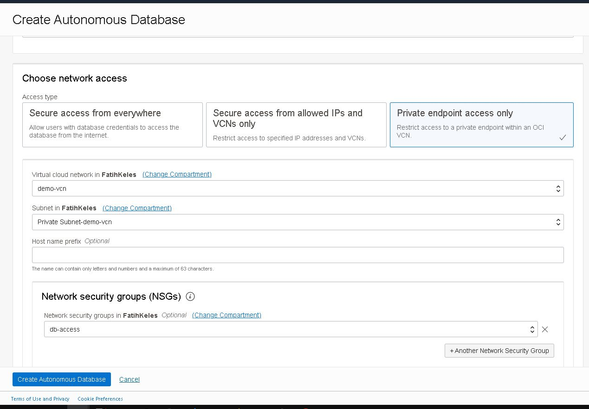
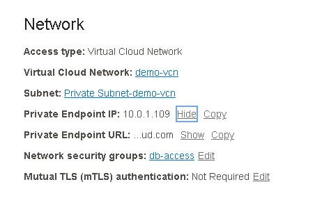
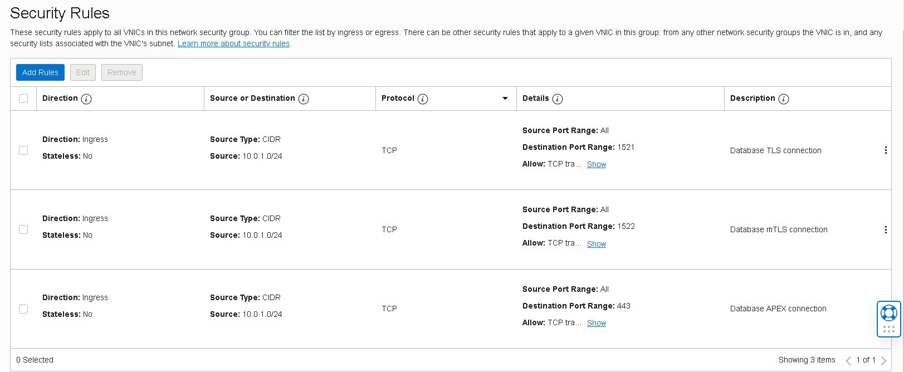
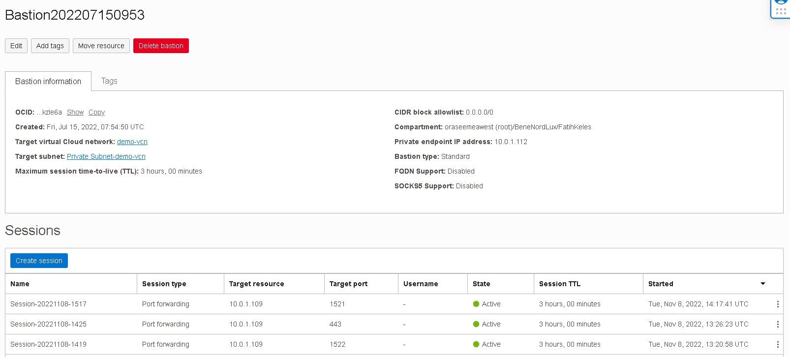
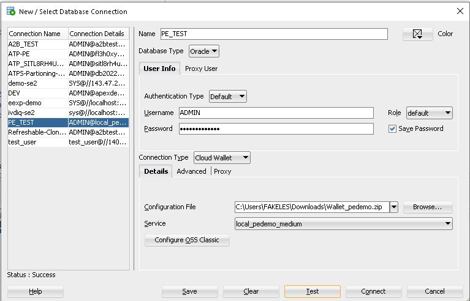
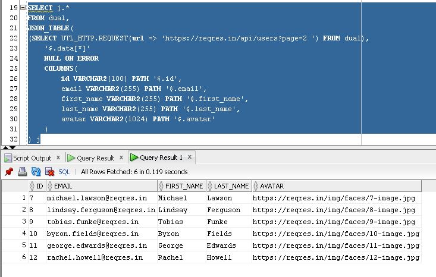

# 3 ways to call a web service from Autonomous Database with Private Endpoint

This article is based on offical documentation from [here](https://docs.oracle.com/en-us/iaas/autonomous-database-shared/doc/call-web-services.html)

## Steps
1. [Environment Setup](#environment-setup)
2. [Accessing ATP instance from local machine](#accessing-atp-instance-from-local-machine)
3. Calling a web service 
    - [Using UTL_HTTP](#using-utl_http) 
    - [Using DBMS_CLOUD](#using-dbms_cloud) 
    - [Using Oracle APEX](#using-oracle-apex) 

## Environment Setup
1. Create an Autonomous database in private subnet



2. After creation networking looks like below. Notice it has a `private endpoint`, so no public access. I preffered controlling access with `network security group` but a `security list` will also work. Since it is in a private network mTLS is not required but supported.



3. NSG security rules looks like below. We are allowing access to ports 1521 and 1522 for database and 443 for APEX/SQL Developer Web etc. from private subnet.



4. I am using bastion service to jump to ATP instance with port forwarding sessions. Bastion service is crated in the same private subnet with ATP private endpoint. 



## Accessing ATP instance from local machine
1. With the command below I am forwarding my local port `15220` to ATP instance PE over bastion server. 
```bash 
ssh -i  ~/.ssh/fkeles-nopass -N -L 15220:10.0.1.109:1522 -p 22 ocid1.bastionsession.oc1.uk-london-1.rzszmsmzudeiliksggemnsckjxruucvkzobtwkpgmxngkktugmpvifjbwkug@host.bastion.uk-london-1.oci.oraclecloud.com
```

And similarly I am forwarding my local port `10443` to access sql developer web console
```bash
ssh -i ~/.ssh/fkeles-nopass -N -L 10443:10.0.1.109:443 -p 22 ocid1.bastionsession.oc1.uk-london-1.rzszmsmzudeiliksggemnsckjxruucvkzobtwkpgmxngkktugmpvifjbwkug@host.bastion.uk-london-1.oci.oraclecloud.com
```

2. I have downloaded Wallet file, extracted it and added a copy of medium connection with a `local` prefix in `tnsnames.ora` like below. It will allow database client to connect my local port `15220` which is forwarded to ATP instance PE.
```
local_pedemo_medium = (description= (retry_count=20)(retry_delay=3)(address=(protocol=tcps)(port=15220)(host=localhost))(connect_data=(service_name=rzszmsmzudeilik_pedemo_medium.adb.oraclecloud.com))(security=(ssl_server_cert_dn="CN=adwc.eucom-central-1.oraclecloud.com, OU=Oracle BMCS FRANKFURT, O=Oracle Corporation, L=Redwood City, ST=California, C=US")))
```

3. I have zipped the folder again and using zipped wallet I was able to connect to database with local `sql developer` client.



[^ back](#steps)

## Using UTL_HTTP
1. Create an ACL for the endpoint host. I am calling rest services publicly available at [https://reqres.in/](https://reqres.in/)
```sql
-- Create an Access Control List for the host
BEGIN
   DBMS_NETWORK_ACL_ADMIN.APPEND_HOST_ACE(
         host => 'reqres.in',
         ace =>  xs$ace_type(privilege_list => xs$name_list('http'),
                             principal_name => 'ADMIN',
                             principal_type => xs_acl.ptype_db));
END;
/
```

2. Unset the wallet location
```sql
-- Set Oracle Wallet location (no arguments needed)
BEGIN
   UTL_HTTP.SET_WALLET('');
END;
/
```

3. Make a GET request 
```sql
-- Submit an HTTP request
SELECT UTL_HTTP.REQUEST(url => 'https://reqres.in/api/users?page=2 ') FROM dual;
```

and we can even make it more sql friendly once we understand the JSON structure
```sql
SELECT j.*
FROM dual, 
JSON_TABLE(
(SELECT UTL_HTTP.REQUEST(url => 'https://reqres.in/api/users?page=2 ') FROM dual),
    '$.data[*]'
    NULL ON ERROR 
    COLUMNS(
        id VARCHAR2(100) PATH '$.id',
        email VARCHAR2(255) PATH '$.email',
        first_name VARCHAR2(255) PATH '$.first_name',
        last_name VARCHAR2(255) PATH '$.last_name',
        avatar VARCHAR2(1024) PATH '$.avatar'
    )
) j
```
Output:



[^ back](#steps)

## Using DBMS_CLOUD
It's even simplier than using [UTL_HTTP](#using-utl_http) option, just invoke the service. For details and samples refer to [official documentation](https://docs.oracle.com/en-us/iaas/autonomous-database-shared/doc/dbms-cloud-subprograms.html#ADBSA-GUID-19B1639E-68E2-45BB-802C-817ABD0DBE88)

```sql
DECLARE
  resp DBMS_CLOUD_TYPES.resp;
BEGIN
  -- Send request
  dbms_output.put_line('Send Request');
  resp := DBMS_CLOUD.send_request(
            uri => 'https://reqres.in/api/users?page=2',
            method => DBMS_CLOUD.METHOD_GET,
            headers => JSON_OBJECT('opc-request-id' value 'list-compartments')
          );
  dbms_output.put_line('Body: ' || '------------' || CHR(10) || DBMS_CLOUD.get_response_text(resp) || CHR(10));
  dbms_output.put_line('Headers: ' || CHR(10) || '------------' || CHR(10) || DBMS_CLOUD.get_response_headers(resp).to_clob || CHR(10));
  dbms_output.put_line('Status Code: ' || CHR(10) || '------------' || CHR(10) || DBMS_CLOUD.get_response_status_code(resp));
  dbms_output.put_line(CHR(10));
END;
/
```
Output:
```json
Send Request
Body: ------------
{"page":2,"per_page":6,"total":12,"total_pages":2,"data":[{"id":7,"email":"michael.lawson@reqres.in","first_name":"Michael","last_name":"Lawson","avatar":"https://reqres.in/img/faces/7-image.jpg"},{"id":8,"email":"lindsay.ferguson@reqres.in","first_name":"Lindsay","last_name":"Ferguson","avatar":"https://reqres.in/img/faces/8-image.jpg"},{"id":9,"email":"tobias.funke@reqres.in","first_name":"Tobias","last_name":"Funke","avatar":"https://reqres.in/img/faces/9-image.jpg"},{"id":10,"email":"byron.fields@reqres.in","first_name":"Byron","last_name":"Fields","avatar":"https://reqres.in/img/faces/10-image.jpg"},{"id":11,"email":"george.edwards@reqres.in","first_name":"George","last_name":"Edwards","avatar":"https://reqres.in/img/faces/11-image.jpg"},{"id":12,"email":"rachel.howell@reqres.in","first_name":"Rachel","last_name":"Howell","avatar":"https://reqres.in/img/faces/12-image.jpg"}],"support":{"url":"https://reqres.in/#support-heading","text":"To keep ReqRes free, contributions towards server costs are appreciated!"}}

Headers: 
------------
{"Date":"Fri, 11 Nov 2022 11:23:23 GMT","Content-Type":"application/json; charset=utf-8","Content-Length":"1030","Connection":"close","X-Powered-By":"Express","Access-Control-Allow-Origin":"*","Etag":"W/\"406-ut0vzoCuidvyMf8arZpMpJ6ZRDw\"","Via":"1.1 vegur","Cache-Control":"max-age=14400","CF-Cache-Status":"HIT","Age":"190","Accept-Ranges":"bytes","Report-To":"{\"endpoints\":[{\"url\":\"https:\\/\\/a.nel.cloudflare.com\\/report\\/v3?s=8mV7%2BRbv4VZznsQlZ%2FLrtRIeY1MO4SDsrorMp0IThlVhn%2BtqQ9E%2BlbuzlB1W8anWngsoSuPGayByearFJOL9so%2FxUR8lmLWFXLyCole7rwLn6IFLDuhwcdMvNQ%3D%3D\"}],\"group\":\"cf-nel\",\"max_age\":604800}","NEL":"{\"success_fraction\":0,\"report_to\":\"cf-nel\",\"max_age\":604800}","Server":"cloudflare","CF-RAY":"7686a7cde9f68865-LHR"}

Status Code: 
------------
200
```

[^ back](#steps)

## Using Oracle APEX
A few things worth mentioning from the [official documentation](https://docs.oracle.com/en-us/iaas/autonomous-database-shared/doc/apex-web-services.html#GUID-DA24C605-384D-4448-B73C-D00C02F5060E)

- All web services must be secured. Only HTTPS services are supported on the default port (443). 
- Connections through IP addresses are not allowed. 
- APEX instance is preconfigured with an Oracle Wallet that contains more than 90 of the most common trusted root and intermediate SSL certificates. The APEX_WEB_SERVICE package automatically takes advantage of this Oracle Wallet without additional configuration from application developers. 

```sql
DECLARE
  l_clob           clob;
  l_buffer         varchar2(32767);
  l_amount         number;
  l_offset         number;
BEGIN
  l_clob := apex_web_service.make_rest_request(
              p_url => 'https://reqres.in/api/users?page=2',
              p_http_method => 'GET',
              p_parm_name => apex_util.string_to_table('appid:format'),
              p_parm_value => apex_util.string_to_table(apex_application.g_x01||':'||apex_application.g_x02));

    l_amount := 32000;
    l_offset := 1;
    BEGIN
        LOOP
            dbms_lob.read( l_clob, l_amount, l_offset, l_buffer );
            --htp.p(l_buffer);
            dbms_output.put_line('Body: ' || '------------' || CHR(10) || l_buffer || CHR(10));
            l_offset := l_offset + l_amount;
            l_amount := 32000;
        END LOOP;
    EXCEPTION
        WHEN no_data_found THEN
            NULL;
    END;
END;
```
Output:
```json
Body: ------------
{"page":2,"per_page":6,"total":12,"total_pages":2,"data":[{"id":7,"email":"michael.lawson@reqres.in","first_name":"Michael","last_name":"Lawson","avatar":"https://reqres.in/img/faces/7-image.jpg"},{"id":8,"email":"lindsay.ferguson@reqres.in","first_name":"Lindsay","last_name":"Ferguson","avatar":"https://reqres.in/img/faces/8-image.jpg"},{"id":9,"email":"tobias.funke@reqres.in","first_name":"Tobias","last_name":"Funke","avatar":"https://reqres.in/img/faces/9-image.jpg"},{"id":10,"email":"byron.fields@reqres.in","first_name":"Byron","last_name":"Fields","avatar":"https://reqres.in/img/faces/10-image.jpg"},{"id":11,"email":"george.edwards@reqres.in","first_name":"George","last_name":"Edwards","avatar":"https://reqres.in/img/faces/11-image.jpg"},{"id":12,"email":"rachel.howell@reqres.in","first_name":"Rachel","last_name":"Howell","avatar":"https://reqres.in/img/faces/12-image.jpg"}],"support":{"url":"https://reqres.in/#support-heading","text":"To keep ReqRes free, contributions towards server costs are appreciated!"}}
```
[^ back](#steps)