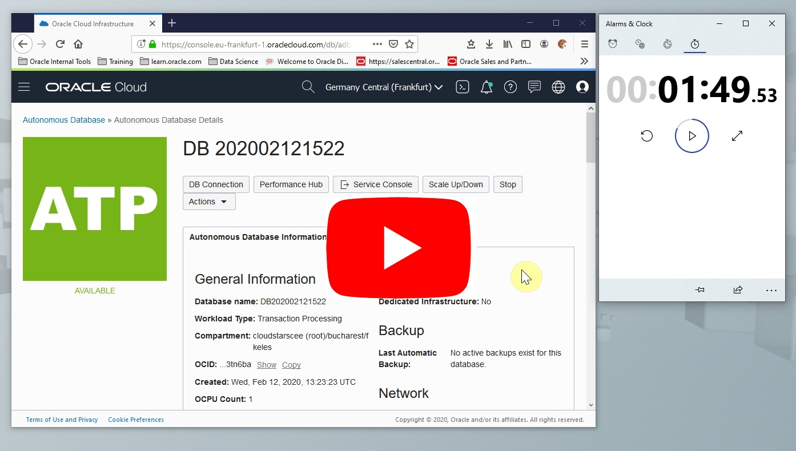
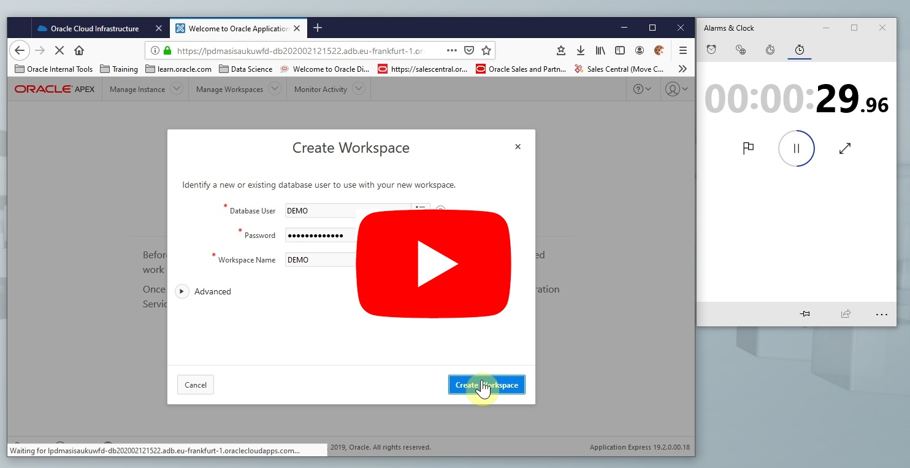
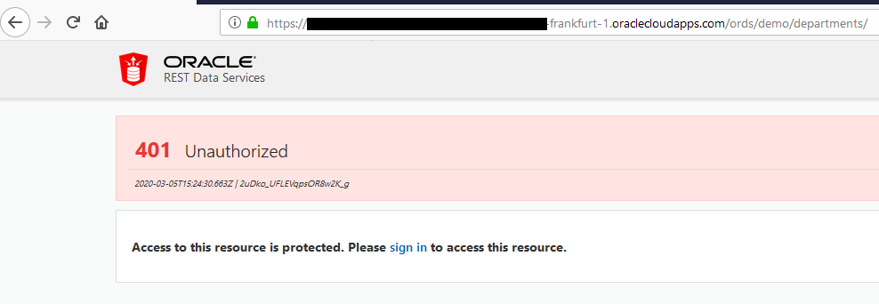
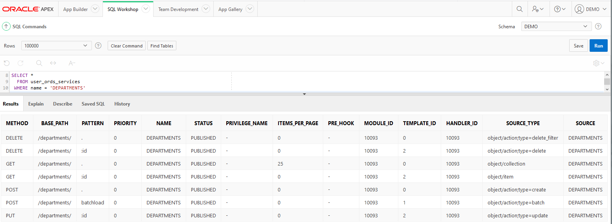
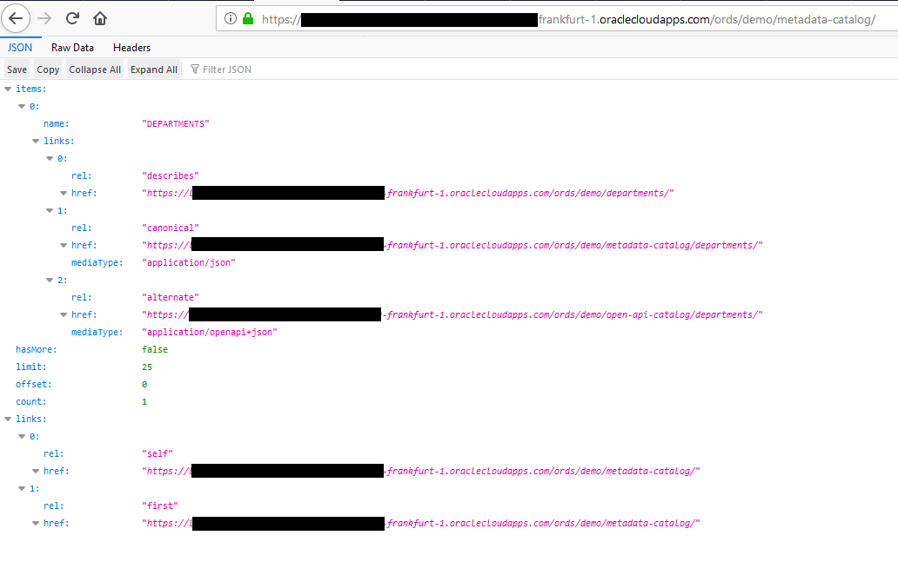

# 30 Minutes Workshop: Use Rest Services Instantly
*Control click the below screenshot to watch the entire demo video on* . *You will find videos which display only the related parts for each section below*
[](https://youtu.be/XRMmDQ28piw)

## Purpose
You will see how you can **instantly publish Secure Rest Services** using **Auto Rest** feature with enterprise grade security. 

This demonstration aims to show how easy to integrate and connect your applications in modern day microservices environment. With ORDS you can achieve productivity, security and simplicty for your enterprise, become agile and more responsive to business needs.

## Prerequsites
1. Create Free Oracle Cloud account, start [here](https://www.oracle.com/cloud/free/ "Oracle Free Tier"). It is totaly free, takes less than two minutes. Credit card information is required to verify your identity, no charges will be incurred. You will get
   + 2 Oracle Autonomous Databases
   + 2 Virtual Machines 
  for free for life as long as you use them.

2. Download [Postman](https://www.postman.com/downloads/ "Download Postman") or have [curl](https://curl.haxx.se/) on your environment. I am going to us Postman, it helps me keep things organized.
   + I generally have [GitHub Desktop](https://desktop.github.com/) and/or [Anaconda Python Distrubution](https://www.anaconda.com/distribution/)  on my environment, both of them bring curl support.
   + I sometimes use Python json tools and/or [jq](https://stedolan.github.io/jq/) to format raw json output 
   ```console
   curl url  | python -mjson.tool
   curl url  | jq
   ```

## Steps
1. [Create Autonoumous Database](#1-create-autonoumous-database-2-min)
2. [Create APEX Workspace](#2-create-apex-workspace-40-sec)
3. [Load CSV File](#3-load-csv-file-1-min) 
4. [Create Application](#4-create-application-1-min) 
5. [Run Application for the First Time](#5-run-application-for-the-first-time-1-min) 
6. [Calendar Page](#6-calendar-page-1-min)
7. [Dashboard](#7-dashboard-6-min)
	- [Chart Genres](#71-chart-genres-1-min)
	- [Chart Runtime](#72-chart-runtime-1-min)
	- [Chart ROI](#73-chart-roi-2-min)
	- [Chart Major Producers](#74-chart-major-producers-2-min)
8. [Report Page](#8-report-page-5-min)
9. [Faceted Search Page](#9-faceted-search-page-8-min)

## 1. Create Autonoumous Database (2 min)
Create your autonomous database in your cloud account. The interface is very intuitive. Follow screen instructions. If you need help press help button on the very same screen.

*Control click the below screenshot to see the video* .
[](https://youtu.be/_cdAjzawbU0)

[^ back](#steps)

## 2. Create APEX Workspace (40 sec)
Login with **ADMIN** user and create an APEX workspace. By doing this you will also be creating a database schema. 

*Control click the below screenshot to see the video* .
[](https://youtu.be/wgCU4hkMtvw)

[^ back](#steps)

## 3. Create Your Tables (1 min)
Logout from *Administration Services* and login using *Workspace Sign-In*

Login with **DEMO** user and create your data structure. For ease of use I will use *Sql Workshop > Utilities > Quick SQL* tool. Check out *Settings* for all capabilities, this is really a productivity tool that you can create *PL/SQL API* or add *Audit Columns* and have *History*. 

The below snippet generates SQL for us, tables, triggers, it even generates some sample data so that we can test our application.
```
departments /insert 4
   name /nn
   location
   country
   employees /insert 25
      name /nn vc50
      email /lower
      salary num
      date hired
      job vc255

view emp_v departments employees
```
*Save SQL Script* then *Review and Run*. 
 

*Control click the below screenshot to see the video*
[](https://youtu.be/EwXDxuooNug)

[^ back](#steps)

## 4. Register Schema with ORDS (1 min)
Navigate to *Sql Workshop > RESTful Services* and *Register Schema with ORDS*. We don't want to *Install Sample Service* for simplicty and set *Authorization Required for Metadata Access* to false so that services can be discovered. We will enable security on each service.

[^ back](#steps)

## 5. Enable REST on Tables (1 min)
Navigate to *Sql Workshop > Object Browser* and click *DEPARTMENTS* on the left pane. Under *REST* tab enable *Rest Enable Object* , disable *Authorization Required* option for the moment and save the changes. After  enabling and saving you will see *RESTful URI*, copy the URL. 

There will be two types of services published, one will be the metadata service, other is the actual service. The URL for services should be in the following form:
```
Metadata Service Catalog URL: https://{SERVER_URL}/ords/{SCHEMA_NAME}/metadata-catalog/
Metadata Object Catalog URL: https://{SERVER_URL}/ords/{SCHEMA_NAME}/metadata-catalog/{OBJECT_NAME}
Service URL: https://{SERVER_URL}/ords/{SCHEMA_NAME}/{OBJECT_NAME}/
```

Copy and paste the URL into your browser and see the list of departments. 
[](#)

Now enable the *Authorization Required* option and see **401 Unauthorized** error page. 
[](#)

ORDS uses OAuth 2.0 industry standard for authentication and authorization. You can see ORDS enabled schemas and objects with the following queries.
```sql
SELECT * FROM user_ords_schemas
SELECT * FROM user_ords_enabled_objects
```

*Control click the below screenshot to see the video*
[](https://youtu.be/EwXDxuooNug)

[^ back](#steps)

## 6. Register Your Test Client
Since we have the tables, sample data, rest services for CRUD operations and security in place, now it is time we test our services. First we must register a client then grant roles to the client.

Navigate to *SQL Workshop>SQL Commands*, using the editor execute the following script to register a client. You can find list of *Privileges* under *SQL Workshop>RESTful Services* menu.
```sql
BEGIN 
  oauth.create_client(
      p_name => 'Postman Test User',
      p_description => 'Postman Test User',
      p_grant_type => 'client_credentials',
      p_privilege_names => 'oracle.dbtools.autorest.privilege.DEMO.DEPARTMENTS',
      p_support_email => 'my.email.address@oracle.com');
  COMMIT;
END;
```

After registering your client you will be able to see your records in the following internal APEX tables. 
```sql
SELECT * FROM user_ords_clients
SELECT * FROM user_ords_client_privileges
```

At this point we need to authorize our client to access our service. Execute the following script for the purpose.
```sql
BEGIN
  oauth.grant_client_role(p_client_name => 'Postman Test User',
                          p_role_name   => 'oracle.dbtools.role.autorest.DEMO.DEPARTMENTS');
  COMMIT;
END;
```

After granting the role to your client you will be able to find your record in the following internal APEX table.
```sql
SELECT * FROM user_ords_client_roles
```

*Control click the below screenshot to see the video*
[](https://youtu.be/EwXDxuooNug)

[^ back](#steps)

## 7. Discover Services 
So far we enabled the services and haven't seen them yet. Let's look at these two ways to discover the services.

## 7.1 Discover Services with SQL
I will start with the easy one. Execute the following query using *SQL Workshop>SQL Commands* to see what methods are available for *DEPARTMENTS* service and find out the signature of them.
```sql
SELECT *
  FROM user_ords_services
 WHERE name = 'DEPARTMENTS'
```

[](#)
You will see 7 methods are available.
|Method|Description|Sample|
|------|-----------|------|
|Delete /:id| Delete with id|```DELETE FROM t WHERE id = :id```
|Delete /.| Bulk delete|```DELETE FROM t WHERE country = 'United States'```
|Get /.| Bulk select|```SELECT * FROM t WHERE name like '%Development%'```
|Get /:id| Select with id|```SELECT * FROM t WHERE id = :id```
|Post /.| Insert|```INSERT INTO t(c1,c2,...) VALUES(v1,v2,...)```
|Post /batchload| Bulk insert|*Multiple inserts or Insert All statement*|
|Put /:id| Update with id|```UPDATE t SET c1=v1,c2=v2,... WHERE id = :id```

*Control click the below screenshot to see the video*
[](https://youtu.be/EwXDxuooNug)

[^ back](#steps)

## 7.2 Discover Services with Metadata Service
If you recall at [Step 4](#4-register-schema-with-ords-1-min) while enabling Auto REST on schema we let the metadata servise to be accessible without authentication so that web service consumers can 

Use the following URL ```https://{SERVER_URL}/ords/{SCHEMA_NAME}/metadata-catalog/``` format and paste it in your browser. You will be able to discover departments service, but you will not be able to use it without proper authentication.
[](#)

*Control click the below screenshot to see the video*
[](https://youtu.be/EwXDxuooNug)

[^ back](#steps)

## 8. Test Authentication for Services
It is time to test our services. 
 - Launch  Postman application 
 - Create a new collection and name it *Auto Rest*
 - Create a new environment 
   + Name it *DEV*
   + Add a new variable ```url``` and set the value with ```{SERVER_URL}/ords/{SCHEMA_NAME}```
 - Add the following request to your collection, save.
      |Name|Method|URL|
	  |----|------|----|
	  |Metadata Service|GET|https://{{url}}/metadata-catalog/|
	  |Metadata Departments|GET|https://{{url}}/metadata-catalog/departments/|
   + Run to see *Metadata Service* is accessible and *Metadata Departments* required authentication and throws *401 Unauthorized* error message.
 - Now lets test OAuth service manually
   + add the ```client_id``` and ```client_secret``` variables to *DEV* environment, find the values of the variables with the following sql. Go to *SQL Workshop>SQL Commands* to execute your query.
   ```sql 
   SELECT client_id, client_secret FROM user_ords_clients
   ```
   + add a new request to test OAuth services
      ```
	  Name: OAuth Service (Manual Test)
	  Method: POST
	  URL: https://{{url}}/oauth/token
	  Authorization.Type: Basic Auth
	  Authorization.Username: {{client_id}}
	  Authorization.Password: {{client_secret}}
	  Headers[0].Key: Content-Type
	  Headers[0].Value: application/x-www-form-urlencoded
	  Body: x-www-form-urlencoded
	  Body[0].Key: grant_type
	  Body[0].Value: client_credentials
	  ```
   + send the request and see the response json
   ```json   {"access_token":"e4qd3QCM75wsKjyl9J0LVQ","token_type":"bearer","expires_in":3600}
   ```
 - Since we have a *access_token*, lets test Departments Metadata service with OAuth.
   + add a new request to test departments metadata service, and see a list of columns of our departments table.
      ```
	  Name: Metadata Departments (Manual Test OAuth with Bearer Token)
	  Method: GET
	  URL: https://{{url}}/metadata-catalog/departments/
	  Headers[0].Key: Authorization
	  Headers[0].Value: Bearer <YOUR ACCESS TOKEN HERE>
	  ```
 - Another way to the is by Postman features of *Get New Access Token* and *Available Tokens*
   + add a new request to test departments metadata service, and see a list of columns of our departments table.
      ```
	  Name: Metadata Departments (Manual Test OAuth with Available Tokens)
	  Method: GET
	  URL: https://{{url}}/metadata-catalog/departments/
	  Authorization.Type: OAuth 2.0
	  Authorization.Add authorization data to: Request Headers
	  ```
   + Click **Get New Access Token** button and fill in the following, request token and use it.
      ```
	  Token Name: OAuth2.0 Departments Token
	  Grant Type: Client Credentials
	  Access Token URL: https://{{url}}/oauth/token
	  Client Id: {{client_id}}
	  Client Secret: {{client_secret}}
	  Client Authentication: Send as Basic Auth header
	  ```
   + Test the service and see the results.

*Control click the below screenshot to see the video*
[](https://youtu.be/EwXDxuooNug)

[^ back](#steps)

## 9. Automate OAuth Authentication
Obtaining OAuth token manually and using it in the header is a quick way to start. When we want to test services more intensive, it will be a burden. By adding a small piece of javascript code at collection level, we will speed things up. The script will check if there is a valid token, and use it. If not then will create one and store it.
 - Add the following variables into your environment, they will be used by script.
 ```
 access_token_expiry
 current_access_token
 ```
 - Click three dots menu on your collection and edit it.
 - Set *Authorization* tab
 ```
 Type: OAuth 2.0
 Add auth data to: Request Headers
 Access Token: {{current_access_token}}
 ```
 - Add the following script in *Pre-request Scripts*
 ```javascript
console.log('Original script is from this gist: https://gist.github.com/bcnzer/073f0fc0b959928b0ca2b173230c0669');

console.log('Get variables from active environment'); 
var service_host = pm.environment.get("url");
var client_id = pm.environment.get("client_id");
var client_secret = pm.environment.get("client_secret");
var basic_authentication_header = btoa(client_id + ':' + client_secret);

console.log('Prepare post request with variables');
var echoPostRequest = {
    url: 'https://'+service_host+'/oauth/token',
    method: 'POST',
    header: {
        //'Accept': '*/*',
        'Content-Type': 'application/x-www-form-urlencoded',
        'Authorization': 'Basic '+basic_authentication_header
    },
    body: {
        mode: 'raw',
        //raw: JSON.stringify({grant_type:'client_credentials'})
        raw: 'grant_type=client_credentials'
    }
};

console.log('Check if the previous token has expired');
var getToken = true;

if (!pm.environment.get('access_token_expiry') || 
    !pm.environment.get('current_access_token')) {
    console.log('Token or expiry date are missing');
} else if (pm.environment.get('access_token_expiry') <= (new Date()).getTime()) {
    console.log('Token is expired');
} else {
    getToken = false;
    console.log('Token and expiry date are all good');
}


console.log('GetToken:'+getToken);
if (getToken === true) {
    pm.sendRequest(echoPostRequest, function (err, res) {
        if (err) {
            console.log(err);
        } else {
            console.log('Saving the token and expiry date');
            var responseJson = res.json();
            pm.environment.set('current_access_token', responseJson.access_token);
            console.log('Access Token is '+responseJson.access_token);
    
            var expiryDate = new Date();
            expiryDate.setSeconds(expiryDate.getSeconds() + responseJson.expires_in);
            pm.environment.set('access_token_expiry', expiryDate.getTime());
            console.log('Token is valid until '+expiryDate);
        }
    });
}
 ```
 
*Control click the below screenshot to see the video*
[](https://youtu.be/EwXDxuooNug)

[^ back](#steps)

## 9. Work with Services 
Download [Postman Collection](./resources/Set-4.postman_collection.json "Postman Collection") and explore the requests. 

## 9.1. List Departments 
We can get a **list** of departments. Service has a builtin paging capability and guides you with *hasMore*, *limit*, *offset*, *count* attributes. It contains links to first, next/previous page as well as metadata service. You can explore the results.

## 9.2. Get One Specific Department 
For accessing one record you can pass **primary key** for the object as a **path variable**.

## 9.3. Insert a New Department 
Use Post method and request body to add a new department.
```json
{
    "name": "EMEA Human Resources",
    "location": "Bucharest",
    "country": "Romania"
}
```
## 9.4. Insert New Departments in Batch
Very useful and easy way to load data to table in batch. Use post method and CSV data in body.
```csv
"ID","NAME","LOCATION","COUNTRY"
,"Germany Human Resources","Bucuresti","Romania"
,"OD SE Team","Bucuresti","Romania"
,"OD SE Hub","Bucuresti","Romania"
,"ISV Team and Alliances","Bucuresti","Romania"
,"Presales EECIS","Bucuresti","Romania"
```
## 9.5. Search Your Data
Iterating the list is not the optimal way to find in rich data sets. You can run **queries** for searching your data with query string in the url and json formatted where clauses. Now lets search all the new departments recently added
```
Key: q
Value: {"country": {"$and": [{"$like":"Romania"}, {"name":{"$like":"%%"}}]}}
```
## 9.5. Update a Department with Primary Key
Using primary key as the path variable and request body we can update data.
```json
{
    "name": "ISV Team and Alliances",
    "location": "Bucharest",
    "country": "Romania"
}
```
## 9.5. Delete a Department with Primary Key
Using primary key as the path variable and Delete method we can delete the record.

## 9.6. Delete Departments in Bulk
Using the query string and delete method we can delete multiple records at once.

*Control click the below screenshot to see the video*
[](https://youtu.be/EwXDxuooNug)

[^ back](#steps)

